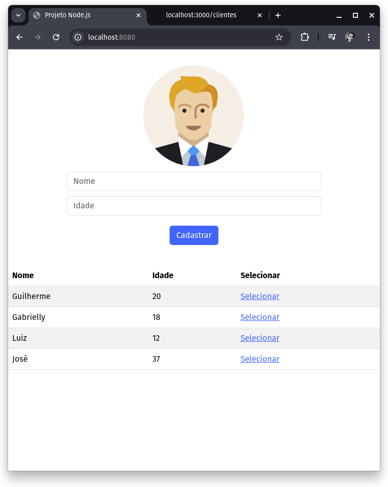

# ClientManager

    

Plataforma web dinâmica e intuitiva projetada para simplificar o processo de cadastro e gerenciamento de clientes. Desenvolvido com Node.js, Express e JSON, o site oferece uma interface amigável que permite aos usuários registrar novos clientes com facilidade, visualizar informações detalhadas e atualizar registros existentes. Através de integrações modernas com JSON e fetch API, o ClientManager assegura uma experiência de usuário fluida e eficiente, garantindo que todas as informações de clientes sejam armazenadas de forma segura e acessível.

## Como usar?

- Dentro da pasta 'front' digite: nodemon app.mjs
- Dentro da pasta 'back' digite: npx json-server clientes.json
